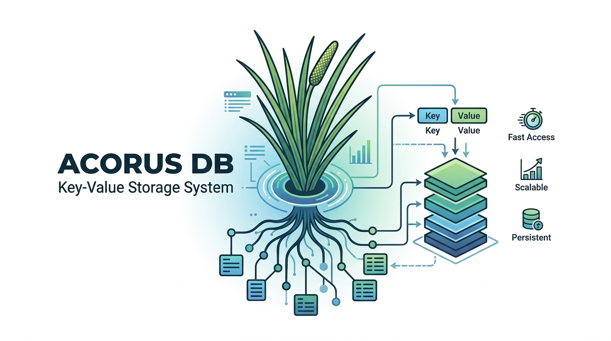

# AcorusDB

<p align="center">
  
</p>

一个基于 Rust 和 Tokio 实现的轻量级 TCP Key-Value 数据库项目。

当前项目已经具备一条完整的最小闭环：

- 文本行协议
- 内存 KV 存储
- WAL 持久化
- manifest 元数据管理
- 多 SSTable 恢复
- memtable flush
- SSTable merge compaction
- tracing 日志
- 配置文件加载
- 优雅停机
- 单元测试与端到端测试

它现在还不是 Redis 兼容实现，也不是完整的 LSM Tree 存储引擎，而是一个结构清晰、适合继续演进的数据库原型。

## 当前能力

- 支持命令：
  - `PING`
  - `SET key value`
  - `GET key`
  - `EXISTS key`
  - `DEL key`
  - `EXIT`
  - `QUIT`
- 支持 `value` 中包含空格。
- `key` 当前不允许包含空白字符。
- 启动时会先加载 manifest 中记录的 SSTable 列表，再回放 WAL。
- active memtable 达到阈值后会触发 flush。
- 活跃 SSTable 总大小达到阈值后，会在下一次成功 flush 后触发 full merge compaction。
- 收到 `Ctrl+C` 或 `SIGTERM` 后会停止接收新连接，并通知现有连接退出。

## 项目结构

- `src/lib.rs`
  - 库入口，导出核心模块。
- `src/main.rs`
  - 二进制入口，只负责 CLI、配置加载、tracing 初始化和启动 server。
- `src/runtime/server.rs`
  - 监听 TCP、接收连接、协调 shutdown。
- `src/runtime/session.rs`
  - 单连接读写循环。
- `src/protocol/`
  - 文本协议命令、解析和响应输出。
- `src/runtime/database.rs`
  - 命令执行入口。
- `src/storage/storage_engine.rs`
  - active memtable、多 SSTable、manifest、WAL、flush 和 compaction 的协调层。
- `src/storage/wal.rs`
  - WAL 读写、恢复和 reset。
- `src/storage/sstable.rs`
  - 单张 SSTable 文件的保存、加载和点查。
- `src/storage/manifest.rs`
  - manifest 原子读写和表列表管理。
- `src/config/`
  - TOML 配置读取和默认值处理。
- `src/support/error.rs`
  - 统一内部错误类型。
- `src/runtime/shutdown.rs`
  - 停机信号处理。

## 运行方式

### 1. 直接启动

```bash
cargo run
```

默认会读取当前目录下的 `acorusdb.toml`。

### 2. 指定配置文件

```bash
cargo run -- --config ./acorusdb.toml
```

或者：

```bash
cargo run -- -c /path/to/acorusdb.toml
```

### 3. 查看帮助

```bash
cargo run -- --help
```

## 配置文件

默认配置文件示例：

```toml
[server]
bind_addr = "127.0.0.1:7634"

[logging]
level = "info"

[sstable]
dir = "data/sstables"
prefix = "acorusdb"
compact_threshold_bytes = 4194304

[wal]
dir = "data/wal"
prefix = "acorusdb"
flush_threshold_entries = 1024
```

字段说明：

- `server.bind_addr`
  - TCP 监听地址。
- `logging.level`
  - tracing 日志级别，例如 `trace`、`debug`、`info`、`warn`、`error`。
- `sstable.dir`
  - SSTable 目录。
- `sstable.prefix`
  - SSTable 文件前缀。当前会自动派生出：
    - `<sstable.dir>/<sstable.prefix>-000001.sst`
    - `<sstable.dir>/<sstable.prefix>-000002.sst`
- `sstable.compact_threshold_bytes`
  - 当前活跃 SSTable 的总文件大小达到阈值后，会在下一次成功 flush 之后触发 full merge compaction。
- `wal.dir`
  - WAL 目录。
- `wal.prefix`
  - WAL 文件前缀。当前会自动派生出：
    - `<wal.dir>/<wal.prefix>.wal`
- `wal.flush_threshold_entries`
  - active memtable 的 entry 数达到阈值后会触发 flush。

## 协议说明

当前协议是简单的文本行协议，一行一个请求。

### 请求

```text
PING
SET name acorus db
GET name
EXISTS name
DEL name
EXIT
```

### 响应

```text
PONG
OK
acorus db
1
0
(nil)
BYE
ERR unknown command
ERR usage: SET key value
```

约定说明：

- `GET` 查不到返回 `(nil)`
- `EXISTS` / `DEL` 返回 `1` 或 `0`
- `EXIT` / `QUIT` 返回 `BYE` 后断开连接

## 调试示例

可以用 `nc` 直接连：

```bash
nc 127.0.0.1 7634
```

然后输入：

```text
PING
SET language rust
GET language
EXISTS language
DEL language
GET language
EXIT
```

## 持久化与恢复

当前写路径大致是：

```text
client command
  -> protocol parse
  -> database execute
  -> WAL append + sync
  -> apply to active memtable
  -> maybe flush
```

当前恢复路径大致是：

```text
load manifest
  -> open referenced sstables from newest to oldest
  -> replay WAL into active memtable
```

### Flush 与 Compaction 设计

当前持久化路径分成两层阈值：

1. `wal.flush_threshold_entries`
   - 控制 active memtable 里累计多少条 entry 之后触发 flush。
2. `sstable.compact_threshold_bytes`
   - 控制当前活跃 SSTable 集合的总文件大小达到多少字节之后触发 compaction。

flush 的实际顺序是：

```text
active memtable reaches flush threshold
  -> write new numbered SSTable
  -> sync SSTable file
  -> update manifest atomically
  -> reset WAL and sync it
  -> clear active memtable
```

compact 的实际顺序是：

```text
successful flush
  -> sum sizes of all active SSTables
  -> if total size >= compact_threshold_bytes:
       merge old SSTables into one new SSTable
       update manifest atomically to point to the merged table
       remove old SSTable files
```

这样设计的原因是：

- compact 判断基于已经落盘的 SSTable 文件，而不是基于 memtable。
- 只有 flush 成功后，最新写入才真正进入 SSTable 集合，compaction 输入才完整。
- manifest 先原子切换到新表，再删除旧表，恢复路径不会因为中途崩溃而引用到一组不一致的表文件。

当前实现特点：

- WAL 每次写入后会 `flush + sync_all`
- SSTable 写出会走临时文件、rename 和目录同步
- manifest 会通过临时文件、rename 和目录同步原子更新
- flush 会写出新的编号 SSTable，并清空 WAL
- 启动时只会加载 manifest 中记录的 SSTable，并按新到旧顺序建立读路径
- 当前 compaction 是 full merge compaction，不是 leveled compaction
- 当前 auto-compaction 由活跃 SSTable 总大小驱动，不是后台线程持续调度
- WAL reset 也做了同步处理
- WAL 最后一行损坏会被视作可能的 torn write 并忽略
- WAL 中间行损坏会作为错误上报

## 磁盘格式

当前项目已经不再使用“整张表直接序列化”的落盘方式，而是定义了一个简单的 SSTable V1 格式。

### WAL

- WAL 是文本行格式。
- 每行一条记录，当前只有两种 opcode：
  - `SET\t<escaped-key>\t<escaped-value>`
  - `DEL\t<escaped-key>`
- 字段分隔符是 `\t`。
- 字段内部会转义这些字符：
  - `\\`
  - `\t`
  - `\n`
  - `\r`
- 空 value 是合法的，可以完整 round-trip。
- 只有“最后一条损坏记录”会被当作可能的 torn write 忽略；中间记录损坏会直接报错。

### SSTable V1

- 当前所有整数都按 big-endian 写入。
- 文件头结构：
  - magic: `ACSS`
  - version: `u8`
  - entry_count: `u64`
- 每条 entry 结构：
  - key_length: `u32`
  - key_bytes: UTF-8
  - value_tag: `u8`
  - 如果是普通值，再写：
    - value_length: `u32`
    - value_bytes: UTF-8
- `value_tag` 当前定义：
  - `0` 表示普通值
  - `1` 表示 tombstone
- entry 按 key 严格递增写出。
- 文件尾不允许出现额外字节。
- 当前版本还没有 index、block、checksum 和 bloom filter。

## Tombstone 设计

当前项目已经把 delete 语义显式建模成 tombstone，并为后续 mini-LSM 演进做准备。

当前规则如下：

1. tombstone 表示“这个 key 被逻辑删除”，而不是“系统里从未出现过这个 key”。
2. 在 [`src/storage/storage_engine.rs`](/Users/fan/MyProjects/acorusdb/src/storage/storage_engine.rs) 中，内存表 `memtable` 使用 `MemValue::Tombstone` 表示删除状态。
3. `GET` 遇到 tombstone 时返回不存在，也就是协议层的 `(nil)`。
4. `EXISTS` 遇到 tombstone 时返回 `false`，也就是协议层的 `0`。
5. 对已经是 tombstone 的 key 再执行一次 `DEL`，返回 `false`。
6. `SET` 可以覆盖 tombstone，使同一个 key 重新生效。
7. WAL 中的 `Delete` 在恢复时会重建成 tombstone，而不是直接把 key 从内存表里移除。
8. 当前 SSTable 也会持久化 tombstone，保证 flush 和重启后删除语义不丢失。
9. 当前 flush 不会主动清理 tombstone，它只是把当前 `memtable` 状态落盘并清空 WAL。
10. 当前 compaction 仍然会保留 tombstone，保证删除语义不退化；后续可以在更严格的安全条件下再清理“已经不再需要遮蔽旧值”的 tombstone。

## 错误处理

项目内部错误统一放在 `AcorusError` 中，当前已经区分了这些主要场景：

- 配置文件读取和解析错误
- 监听地址 bind 失败
- shutdown 信号安装失败
- WAL 打开、读取、写入、reset 失败
- WAL 损坏
- SSTable 编码、写入、读取、删除、解码失败
- manifest 读取、解析、写入失败

协议错误单独保留在 `protocol` 层，不和内部运行时错误混在一起。

其中：

- `CorruptedWal` 会带上类似 `line 1.value`、`line 2.command` 这种定位。
- `CorruptedSSTable` 会带上类似 `header.magic`、`entry 0.value_tag`、`trailer` 这种定位。

## 优雅停机

收到 `Ctrl+C` 或 `SIGTERM` 后：

1. server 停止接收新连接
2. 向活跃 session 广播 shutdown
3. 连接收到 `BYE`
4. 等待 session 收尾
5. 进程退出

## 测试

运行测试：

```bash
cargo test
```

当前测试覆盖包括：

- 协议解析
- WAL 编解码
- `set/delete/restart` 恢复
- tombstone 重启恢复与重复删除语义
- `SET -> DEL -> SET` 之后的 key 复活语义
- flush 后恢复
- flush 后 tombstone 保留
- auto-compaction 阈值触发与最新值保留
- `sstable + wal` 叠加恢复
- 多 SSTable 启动恢复和覆盖顺序
- manifest 驱动恢复、orphan SSTable 忽略和损坏 manifest 报错
- SSTable 直接读写、排序、tombstone 保留和损坏定位
- 重启后和 flush 后的 key 顺序稳定性
- WAL 损坏边界和字段定位
- TCP 会话端到端读写
- shutdown 时客户端收到 `BYE`

## 当前限制

- 还不是 RESP 协议
- 还不是 Redis 客户端兼容实现
- 当前 SSTable 还没有 sparse index、checksum 和 block 结构
- 当前单表点查还是朴素实现，会直接加载整张表
- 当前 compaction 还是 full merge compaction，还没有 leveled 策略
- 当前 compaction 还没有清理无效 tombstone
- 当前还没有后台 compaction、Bloom filter 和 benchmark
- 当前存储结构还不是完整的 LSM Tree

## 下一步方向

下一步计划已经整理在 [TODO.md](/Users/fan/MyProjects/acorusdb/TODO.md)。

核心方向是把当前存储引擎逐步演进成一个 mini-LSM：

- 先把当前 full merge compaction 补齐 tombstone 清理和测试覆盖
- 然后给 SSTable 增加 sparse index，降低点查的整表读取成本
- 最后再逐步补 Bloom filter、benchmark 和更进一步的 compaction 策略
